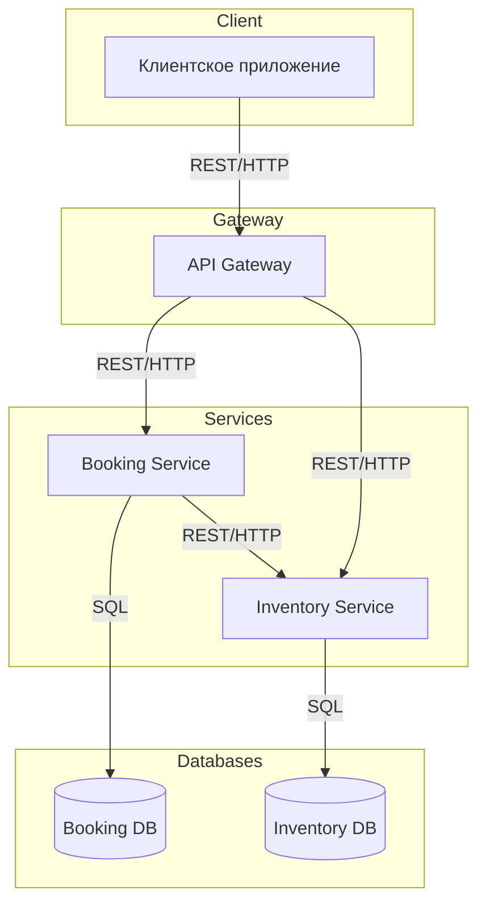
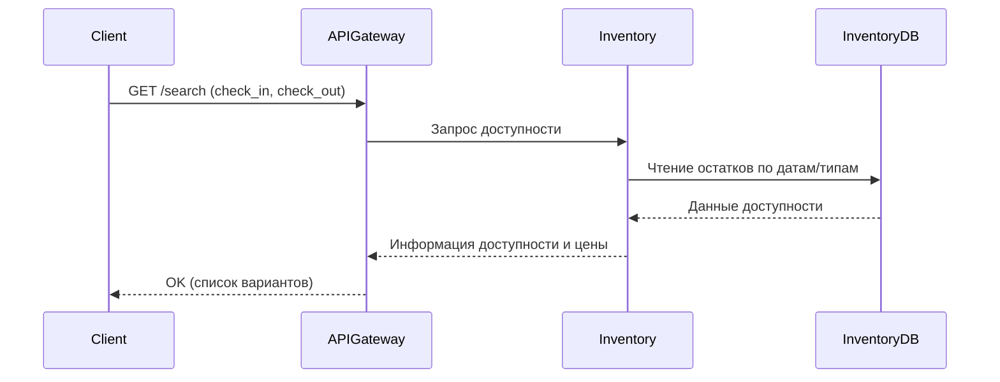
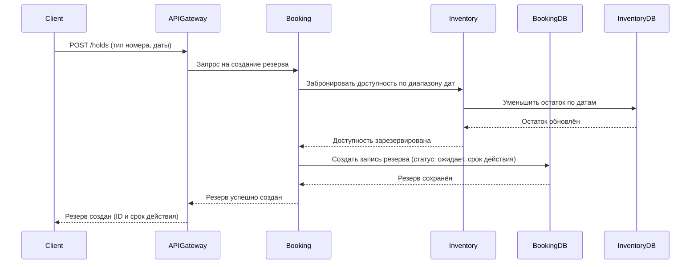
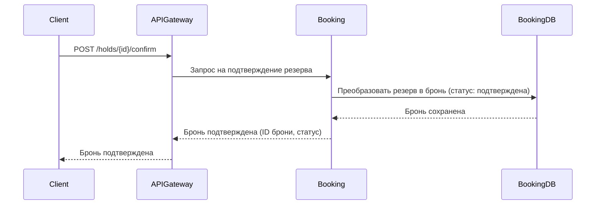
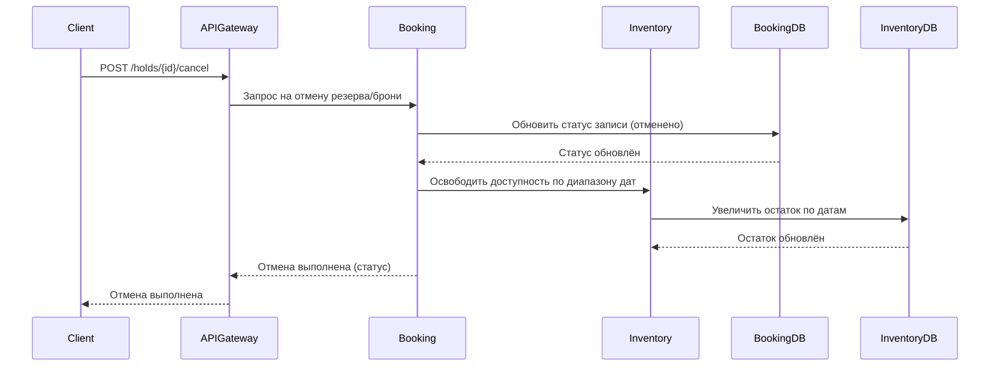
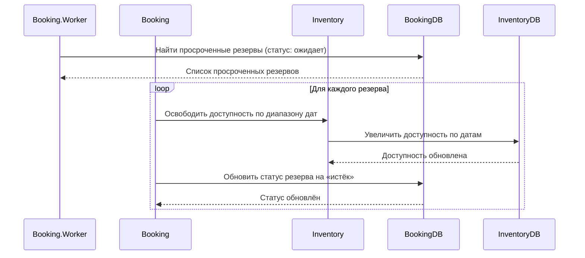
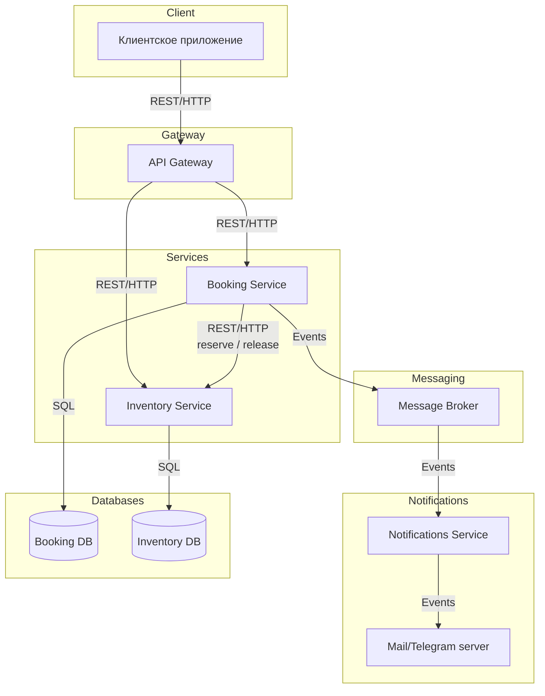

# Техническое решение проекта «Hotel Booking»

## Введение
- **Цель проекта:**  
  Разработать минимально жизнеспособную распределённую систему онлайн‑бронирования номеров в отеле, обеспечивающую корректный учёт доступности и предотвращение «двойной продажи» номера за счёт транзакций/идемпотентности. Система должна позволять искать доступность по датам, создавать временный резерв (hold), подтверждать бронь, отменять и автоматически истекать резервы.

- **Основания для разработки:**  
  Учебный проект по курсу «Распределённые системы».

- **Команда (2 человека):**  
  1) Разработчик Скородумов Владислав.  
  2) Разработчик Никитин Александр. 

---

## Глоссарий
| Термин                                    | Определение                                                                          |
| ----------------------------------------- | ------------------------------------------------------------------------------------ |
| **Тип номера (RoomType)**                 | Категория размещения (эконом/стандарт/делюкс), вместимость, базовая цена.            |
| **Инвентарь (Inventory)**                 | Количество доступных единиц по (room_type, дата).                                    |
| **Доступность**                           | Возможность предоставить номер каждого дня в диапазоне проживания.                   |
| **Резерв / Hold**                         | Временная блокировка единицы инвентаря на период проживания; имеет TTL.              |
| **Бронь / Booking**                       | Подтверждённый результат резерва (после оплаты или ручного подтверждения).           |
| **Пользователь / Гость**                  | Клиент, оформляющий бронь.                                                           |
| **TTL**                                   | Время жизни резерва; по истечении — автоматическое освобождение.                     |
| **Идемпотентность**                       | Повтор вызова с одним ключом приводит к одному и тому же эффекту (защита от дублей). |
| **API Gateway**                           | Входная точка REST/JSON, маршрутизация и валидация запросов.                         |
| **Сервис бронирования (Booking Service)** | Оркестратор жизненного цикла: create hold → confirm/cancel → expire.                 |
| **Сервис инвентаря (Inventory Service)**  | Хранит и атомарно изменяет остатки инвентаря по датам/типам.                         |

---

## Функциональные требования (MVP)
1. Поиск доступности по датам заезда/выезда и параметрам размещения.  
2. Создание резерва (Hold) на период проживания.  
3. Подтверждение брони.  
4. Автоматическое истечение резерва по TTL.  
5. Отмена резерва/брони.  
6. Просмотр списка и деталей броней пользователя.  
7. Администрирование типов номеров и исходной матрицы инвентаря.

---

## Нефункциональные требования
- Консистентность при сбоях за счёт идемпотентности и транзакций.  
- Время отклика: поиск ≤ 200 мс (локальная сеть), создание резерва ≤ 300 мс.  
- Надёжность: устойчивость к падению одного сервиса; задачи TTL перезапускаемы.  
- Масштабируемость: горизонтальное масштабирование сервисов.  
- Безопасность: базовая валидация входных данных.  

---

## Пользовательские сценарии

### Сценарий 1. Поиск доступных номеров
1. Пользователь выбирает даты заезда и выезда.  
2. Система показывает список доступных номеров с ценой.  

### Сценарий 2. Создание брони
1. Пользователь выбирает номер из списка.  
2. Система временно бронирует номер и сообщает пользователю код брони.  

### Сценарий 3. Подтверждение брони
1. Пользователь подтверждает бронь.  
2. Система переводит бронь в статус подтверждённой.  

### Сценарий 4. Просмотр броней
1. Пользователь открывает раздел «Мои брони».  
2. Система показывает список всех броней пользователя с их статусами.  

### Сценарий 5. Отмена брони
1. Пользователь выбирает бронь и нажимает «Отменить».  
2. Система отменяет бронь и освобождает номер.  

---

## Архитектура

### Основные компоненты
1. **API Gateway** — входная точка системы, маршрутизация клиентских запросов к внутренним сервисам.  
2. **Booking Service** — управление жизненным циклом резерва и брони (создание, подтверждение, отмена, истечение).  
3. **Inventory Service** — проверка и изменение доступности по типам номеров и датам.  
4. **Booking DB** — транзакционная база данных сервиса Booking.  
5. **Inventory DB** — транзакционная база данных сервиса Inventory. 

### Взаимодействия и интерфейсы
- **API Gateway ↔ Booking Service:** REST/HTTP для операций резерва, подтверждения, отмены, получения списка броней.  
- **API Gateway ↔ Inventory Service:** REST/HTTP для поиска доступности и административных операций по инвентарю.  
- **Booking Service ↔ Inventory Service:** REST/HTTP для атомарного резервирования/освобождения доступности на диапазон дат.  
- **Booking Service ↔ Booking DB:** SQL-транзакции для записи резерва/брони и их статусов.  
- **Inventory Service ↔ Inventory DB:** SQL-транзакции для изменения остатков по (room_type, date).  

---

## Технические сценарии

### Поиск доступности
1. Клиент отправляет в API Gateway запрос GET /search с параметрами дат.  
2. API Gateway перенаправляет запрос в Inventory Service.  
3. Inventory Service читает Inventory DB и агрегирует доступность по диапазону.  
4. Inventory Service возвращает агрегированный список доступных типов номеров и цен.  
5. API Gateway возвращает ответ клиенту.

### Создание резерва
1. Клиент отправляет в API Gateway запрос POST /holds с параметрами дат и типа номера.  
2. API Gateway перенаправляет запрос в Booking Service.  
3. Booking Service запрашивает у Inventory Service резервирование на диапазон дат.  
4. Inventory Service в транзакции уменьшает доступность в Inventory DB и возвращает подтверждение.  
5. Booking Service в транзакции создаёт запись резерва в Booking DB и возвращает клиенту идентификатор резерва и время истечения.

### Подтверждение брони
1. Клиент отправляет в API Gateway запрос POST /holds/{id}/confirm.  
2. API Gateway перенаправляет запрос в Booking Service.  
3. Booking Service в транзакции обновляет статус резерва на подтверждённую бронь в Booking DB.  
4. API Gateway возвращает клиенту идентификатор брони и статус.

### Отмена резерва/брони
1. Клиент отправляет в API Gateway запрос POST /holds/{id}/cancel.  
2. API Gateway перенаправляет запрос в Booking Service.  
3. Booking Service в транзакции меняет статус записи в Booking DB и вызывает Inventory Service для освобождения доступности по диапазону дат.  
4. Inventory Service в транзакции увеличивает доступность в Inventory DB.  
5. API Gateway возвращает клиенту статус отмены.

### Автоматическое истечение резерва
1. Плановая задача в Booking Service периодически запрашивает просроченные резервы в Booking DB.  
2. Для каждого просроченного резерва Booking Service вызывает Inventory Service для освобождения доступности.  
3. Inventory Service в транзакции увеличивает доступность в Inventory DB.  
4. Booking Service в транзакции обновляет статус резерва на «истёк» в Booking DB.

---

## План разработки и тестирования

### MVP
**Состав:**
- API Gateway, Booking Service, Inventory Service.  
- Booking DB, Inventory DB.  

**План разработки:**
1. Проектирование интерфейсов сервисов и схем БД.  
2. Реализация Inventory Service (CRUD room_types, операции reserve/release, поиск доступности).  
3. Реализация Booking Service (create hold, confirm, cancel, истечение).  
4. Реализация API Gateway (роутинг, валидация, объединение ответов).  
5. Документация API.  

**План тестирования:**
- Модульные тесты Inventory (reserve/release, инварианты).  
- Модульные тесты Booking (создание/подтверждение/отмена/истечение).  
- Интеграционные тесты Booking↔Inventory (гоночные условия, повторные запросы).  
- Тесты API Gateway (валидные/невалидные входные данные).  

**Definition of Done (DoD) для MVP:**
- Реализованы все пользовательские сценарии.  
- Пройден набор интеграционных тестов.  
- Документация API доступна. 
- Все модули покрыты тестами

### Расширения (после MVP)
### Интеграция уведомлений (email/telegram)

#### Состав
- **Booking Service** — источник событий (`BookingConfirmed`, `BookingCanceled`, `HoldExpired`), запись в таблицу `outbox`, публикация в брокер.  
- **Message Broker (RabbitMQ)** — доставка событий между сервисами.  
- **Notifications Service** — подписчик на события.  
- **Mail/Telegram Server** — приём и просмотр писем.

---

#### План разработки
1. Добавить таблицу `outbox` и публикацию событий в Booking.  
2. Подключить RabbitMQ.  
3. Реализовать Notifications Service с consumer’ом брокера. 
4. Обновить документацию и переменные окружения.

---

#### План тестирования
- Проверить запись событий в `outbox` при подтверждении/отмене/истечении.  
- Проверить доставку сообщений в RabbitMQ и получение их Notifications.  
- Тесты на идемпотентность (повторная доставка события). 
- Интеграционный тест цепочки: `confirm` → событие → очередь → письмо.

---

#### Definition of Done (DoD)
- События корректно пишутся в `outbox` и публикуются в брокер.  
- Notifications получает и обрабатывает события, письма отправляются.  
- Повторы и сбои обрабатываются безопасно.  
- Все тесты проходят.  
- Обновлена документация по запуску и конфигурации уведомлений.

